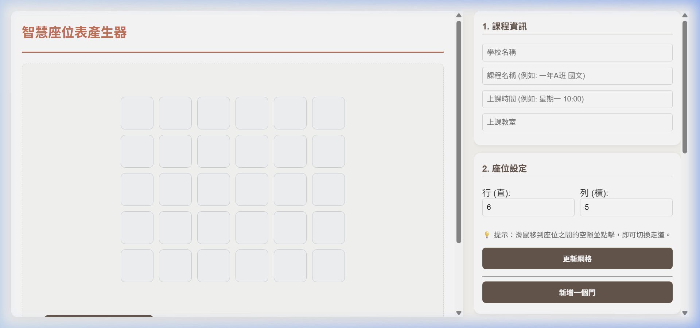
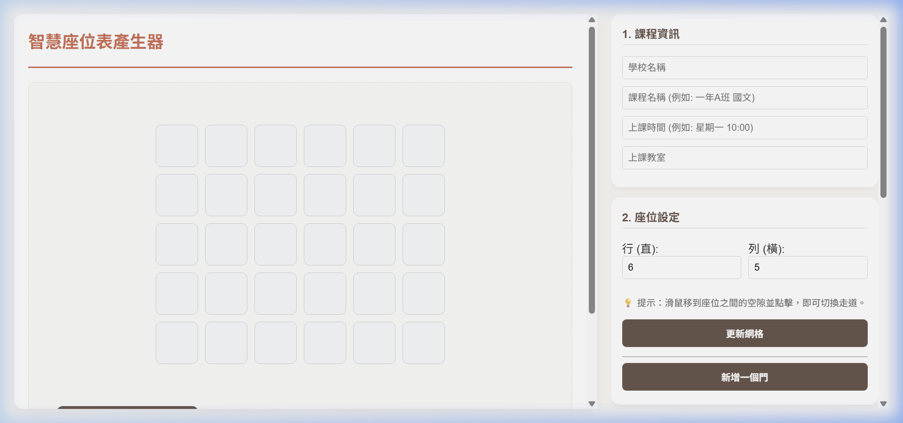

# 座位表產生器 - 操作圖文說明

歡迎使用「座位表產生器」！這是一個專為老師設計的排座位工具，能夠輕鬆安排班級座位、設定走道，並匯出成圖片或 Excel。

## 1. 填寫課程資訊與設定網格
一開始，您可以在右側面板設定**課程資訊**（如學校、課程、時間、教室）。
接著在**座位設定**區塊，輸入您需要的「行」與「列」數，然後點擊「**更新網格**」。

## 2. 匯入名單與自動排座
您可以將學生名單貼入文字方塊中（每行一個名字），然後點擊「**產生學生名單**」。
- 您可以用滑鼠（或在平板上用手指）將學生拖曳到任何座位上。
- 或者點擊「**自動分配座位 (S型)**」來一鍵填滿座位。
- 也可以點擊「**相鄰分組模式**」來自動把相鄰的座位兩兩一組！

## 3. 設定走道
這是一個非常強大的功能！
當您將滑鼠（或手指）移到座位與座位之間的**空隙**時，會出現藍色的提示條。
- **點擊**藍色提示條，就會在該處產生一條寬敞的走道！
- 再次點擊，就可以取消走道。

## 4. 加入「門」
如果您需要標示教室門的位置，點擊「**新增一個門**」。
- 您可以自由將門拖曳到教室的四個邊界上。
- 連續點擊兩下門即可刪除它。

## 5. 匯出座位表
排好座位後，您可以點擊左下角的按鈕將座位表存檔：
- **下載圖片**：將目前的座位表儲存為 PNG 圖片。
- **下載 Excel**：將座位表匯出為 Excel 檔案，方便後續列印或編輯。

---
💡 **小技巧**：如果您排到一半需要暫停，可以點擊「**儲存草稿**」，下次進來時只要點擊「**讀取草稿**」就能繼續編輯！
